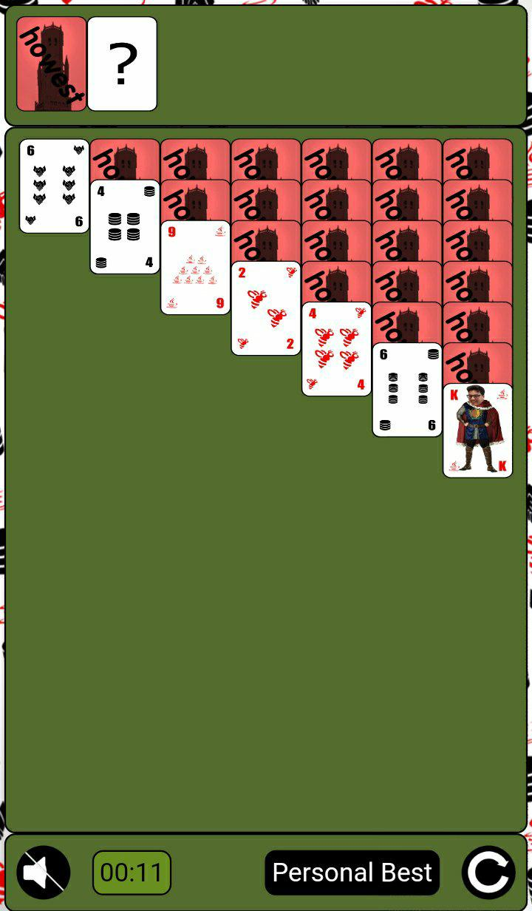

# Howest Solitaire Read Me

## Table Of Contents

1.  Repository
2.  App's Function
3.  Used Technologies
4.  Hosted by Github Pages

## 1\. Repository

[GitHub Repository of Howest Solitaire](https://github.com/VermeulenRuben/HowestSolitaire)

## 2\. App's Function

This app is a recreation of a game called Solitaire aka Patience. This game doesn't use classic playing cards however. The cards have subtle and literal references to teachers of Howest TI.

For an explanation on how the game of Solitaire is played. I will refer to this Wikipedia article: [Wikipedia - Solitaire/Patience(game)](https://en.wikipedia.org/wiki/Patience_(game))

My application can be divided into 4 sections according to the html:

1.  The goal

    The goal of the card game is an array of 4 where a card is pushed into. If there is nothing in the goal yet any ace can fit in it. If there is the only the card with the same category and that has the cardnumber following the number of the card currently in the goal can fit in the goal.

    You win the game when each of the 4 arrays are filled in with a card with the cardnumber "k".

2.  The deck

    The deck of the card game is an array of 24\. At the start of a game this array is completely filled with randomly picked cards who have their backs turned. When clicking on the deck you will be able to flip cards. These cards will then be pushed to the given array. When the deck is empty a card with a question mark will appear.

3.  The given

    The given array is an array of 24\. At the start of a game this array will be empty (indicated by the question mark card). When clicking on the deck you will be able to flip cards. These cards will then be pushed to the given array. The cards that were on the deck are then fully visible in the given. When clicking on the given the app will decide if there is a valid position for the card displayed. If there isn't nothing will happen, if there is the card will be placed at the FIRST valid position found and the card will be removed from the given array.

4.  The table

    The table of the card game is an array of 7 arrays of 13\. At the start of the game each array gets filled in with cards. The first row gets filled with 1 card which increases the farther we go to the right, peaking at the seventh row with seven cards. The last card of the row is flipped on his back and is fully visible. when a card gets taken from the table. The card behind him gets flipped, if it wasn't already flipped. When a row is empty, only a king can be added to that row.

## 3\. Used Technologies

### Object Oriented Javascript and Pseudo Model-View Principles

I chose for javascript because I didn't really have a need for a back-end server. It was far easier to host static files on Github Pages then it would be to make a NodeJS backend which would have the same functionality. I did choose not to implement jquery as a personal test to learn pure javascript. I chose to implement a pseudo model-view structure. With the model being "card.js" and the view being "output.js".

Even though static files were easier to host, documentation of some technologies list was very hard to find because most documentation was for a NodeJS server and used "npm install" to implement these technologies.

### Manifest and Service Worker

By using a manifest config, my web app can now be installed as an native application onto anyone's phone. With the service worker, my app can now cache multiple files offline. This means my app is able to function offline.

### LocalForage

The app uses localForage to store the best personal time after winning a game. It also shows your current best personal time in a popUpScreen when pushing the button "Personal Best".

## 4\. Used Technologies

Press the following link on your mobile phone: [Howest Solitaire - GitHub Pages](http://vermeulenruben.github.io/HowestSolitaire/)